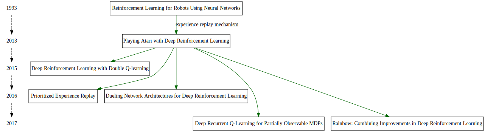
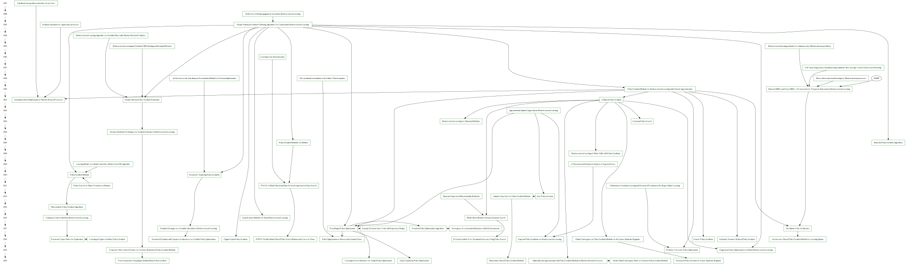

## Reading Progress

|Date|Acronym| Title |Abstraction and Conclusion|Introduction and Related works|Algorthim|Mathmetics|Experiments|Discussion|Code|Others|
|:---:|:---:|:------------:|:---:|:---:|:---:|:---:|:---:|:---:|:---:|:---:|
|Aug 26,2020|DQN|Playing Atari with Deep Reinforcement Learning|Done|Done|Done|Done|Done|Done|Done||
|Aug 27,2020|DQN|Human-level control through deep reinforcement learning|Done|Done|Done|Done|Done|Done|Done||
|Aug 29,2020||Reinforcement Learning for Robots Using Neural Networks||||||||chaper3|
|Oct 12,2020|Double DQN|Deep Reinforcement Learning with Double Q-learning|Done|Done|Done|Done|Done|Done|Done||
|Oct 15,2020|PER|Prioritized Experience Replay|Done|Done|Done|Done|Done|Done|Done||
|Oct 22,2020|Dueling DQN|Dueling Network Architectures for Deep Reinforcement Learning|Done|Done|Done|Done|Done|Done|Done||
|Oct 22,2020|Rainbow DQN|Rainbow: Combining Improvements in Deep Reinforcement Learning|Done|Done|Done|Done|Done|Done|||
|Oct 28,2020|Deep Recurrent Q-Learning|Deep Recurrent Q-Learning for Partially Observable MDPs|Done||||||||
|Nov 3,2020|A3C|Asynchronous Methods for Deep Reinforcement Learning|Done|Done|Done|Done|Done||||
|Nov 7,2020|TRPO|Trust Region Policy Optimization|Done|Done|Done|Done|Done||||
|Dec 2,2020|GAE|Emergence of Locomotion Behaviours in Rich Environments|Done||||||||
|Dec 3,2020|PPO|Proximal Policy Optimization Algorithms|Done||||||||
|Dec 4,2020|PG|Policy Gradient Methods for Reinforcement Learning with Function Approximation|Done|Done|Done|Done|Done|Done|||
|Dec 6,2020||Approximately optimal approximate reinforcement learning|Done||||||||
|Dec 7,2020||A Natural Policy Gradient|Done||||||||
|Dec 8,2020|REINFORCE|Simple statistical gradient-following algorithms for connectionist reinforcement learning|Done|Done|Done|Done|Done|Done|||
|Dec 9,2020||Reinforcement Learning Algorithm for Partially Observable Markov Decision Problems|Done||||||||
|Dec 10,2020|ACER|Sample Efficient Actor-Critic with Experience Replay|Done||||||||

## graph of DQN papers

## graph of PG papers
